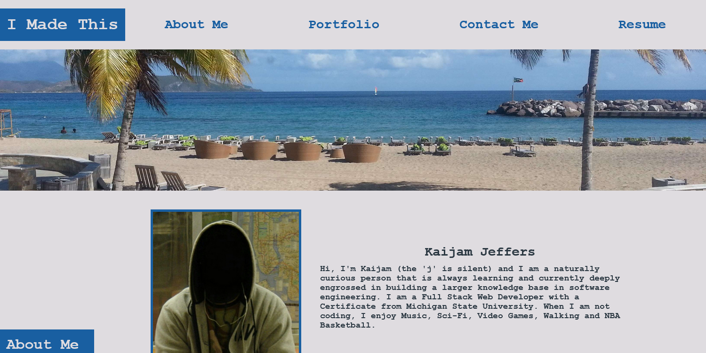

# Reactive Portfolio

## Description
Reactive Portfolio is a ligntwight single page application for displaying a portfolio made with responsive design in mind.

## Table of Contents
* [Features](#features)
* [Technologies](#technologies)
* [Installation](#installation)
* [Usage](#usage)
* [Demonstration](#demonstration)
* [Screenshot](#screenshot)

## Features
A modern and responsive single page application created in React.js.
Display portfolio with links to source and examples.
Display contact information.

## Technologies
Javascript
Node.js
React.js
Bootstrap

## Installation
Clone the repository.
Install any dependencies.
Modify to your liking.
Deploy to Github Pages.

## Usage
Browse portfolio examples, connect to creator via contact informaton.

## Demonstration
Here is a [Live Demonstration](https://faceless128.github.io/reactive-portfolio)

## Screenshot

